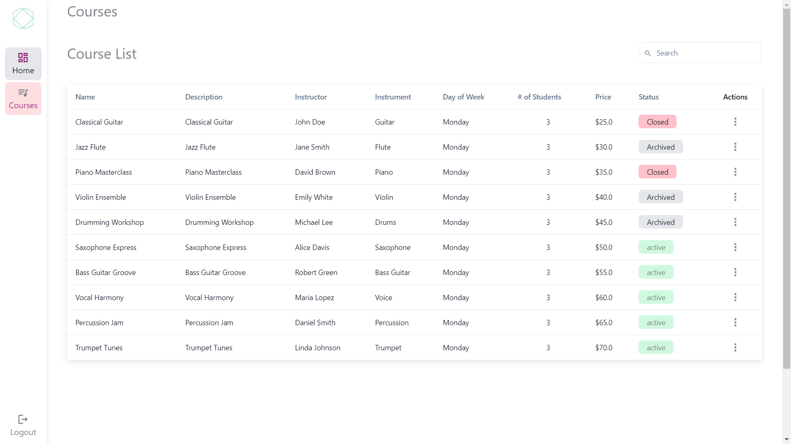
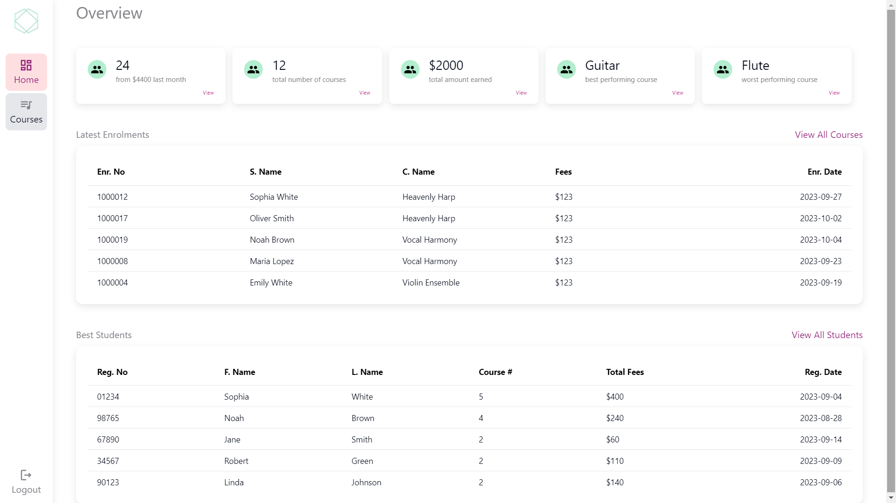
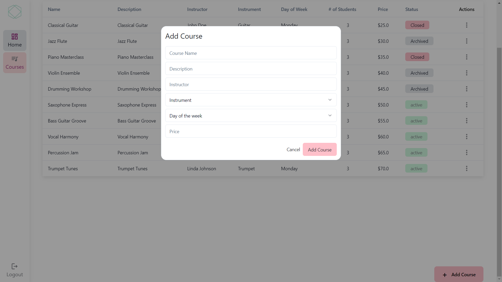

# Music_School Web Application

Welcome to the Music_School Web Application! This web application allows you to browse the Courses and the Enrollment data of user

## Table of Contents

- [About](#about)
- [Features](#features)
- [Getting Started](#getting-started)
- [Usage](#usage)
- [Technologies Used](#technologies-used)
- [Deployment](#deployment)
- [Contributing](#contributing)
- [License](#license)

## About

Music_School Web Application! is a web application designed to store the data of courses and student
## Features

- Browse a collection of courses.
- toggle the course status.
- Add new Courses.
- Search the Courses.
- User Authenticatiuon

## Screenshots

## Deployment

Deployed Link:-

## Getting Started

# Clone the repository

git clone https://github.com/Abu1Osama/Octalogic_Assignment

# Change directory

cd your-repo

# Install dependencies

npm install

# Start the development server

npm run dev

## Technologies Used

- Music_School Web Application is built using the following technologies:

- React.js
- Tailwind CSS
- Axios
- JavaScript
- Shadcn/ui
- json-server
- Vite
- Redux

## Usage

- Visit the application in your web browser at http://localhost:3000 or the URL  .
1. Browse a collection of courses.
2. toggle the course status.
3. Add new Courses.
4. Search the Courses.

## Note:- Register and Login first to visit the Dashboard
